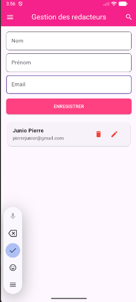

# 📱 Gestion des redacteurs — Flutter & SQLite

## 📌 Description

Ce projet est une application **Flutter** permettant de gérer une liste de redacteurs (CRUD) avec les fonctionnalités suivantes :

* ➕ Ajouter un redacteur
* ✏️ Modifier un redacteur
* 🗑️ Supprimer un redacteur avec **boîte de confirmation**
* 📋 Afficher la liste via `ListView.builder`
* 💾 Persistance des données avec **SQLite (sqflite)**

L’application illustre les bonnes pratiques Flutter :

* `StatefulWidget`
* séparation des responsabilités
* gestion de l’état avec `setState`
* interaction UI ↔ base de données

---

## 🧱 Technologies utilisées

* **Flutter**
* **Dart**
* **sqflite**
* **path**
* **Material Design**


---

## 👤 Modèle : Redacteur

```dart
class Redacteur {
  int? id;
  String nom;
  String prenom;
  String email;

  Redacteur({
    required this.id,
    required this.nom,
    required this.prenom,
    required this.email,
  });

  Redacteur.sansId({
    required this.nom,
    required this.prenom,
    required this.email,
  });
}
```

---

## 🗄️ Base de données (SQLite)

* Base locale avec **sqflite**
* Table `redacteurs`
* Opérations :

  * `initialisation`
  * `getAllRedacteurs`
  * `insertRedacteur`
  * `updateRedacteur`
  * `deleteRedacteur`
---

## 🖥️ Fonctionnalités UI

### 📋 Liste des redacteurs

* `ListView.builder`
* Icônes :

  * ✏️ Modifier
  * 🗑️ Supprimer

### ⚠️ Confirmation de suppression

* `showDialog`
* `AlertDialog`
* Boutons **Annuler / Supprimer**

---

## ▶️ Lancer le projet

### 1️⃣ Installer les dépendances

```bash
flutter pub get
```

### 2️⃣ Lancer l’application

```bash
flutter run
```

## 🎯 Objectifs pédagogiques

* Comprendre le fonctionnement des **StatefulWidget**
* Maîtriser la **transmission d’objets par référence**
* Relier Flutter à une **base de données locale**
* Implémenter un CRUD complet
* Structurer proprement un projet Flutter

---

## 🚀 Améliorations possibles

* 🔍 Recherche de personnes
* 📊 Tri (nom, prénom)
* ✅ Validation des champs
* 🎨 Amélioration UI
* 🔄 State management (Provider / Bloc)

---

## 📸 Aperçu

L'image ci-dessus montre l’interface principale de l’application, mettant en avant le design épuré et la présentation des contenus.

---

## 👨‍💻 Auteur

Projet réalisé dans un but **pédagogique** pour l’apprentissage de Flutter, Dart et SQLite.

## 📄 Licence

Ce projet est sous licence **MIT**. Vous êtes libre de l’utiliser, le modifier et le distribuer.
